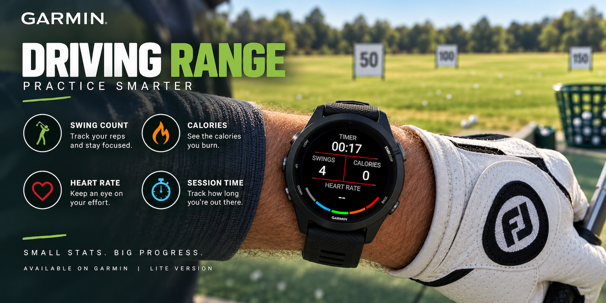
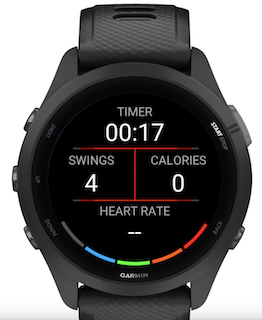
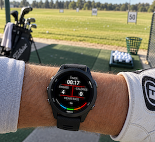
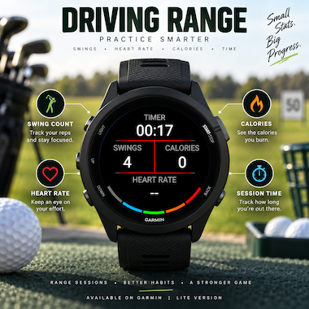
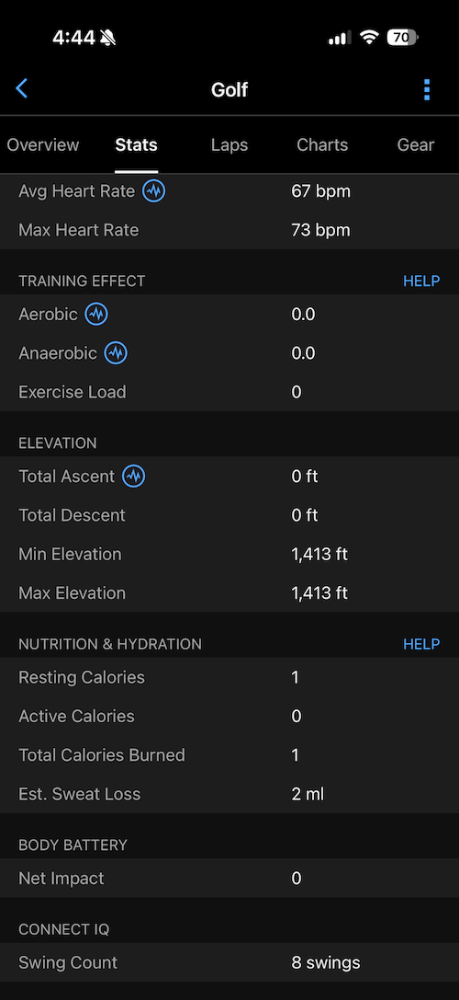
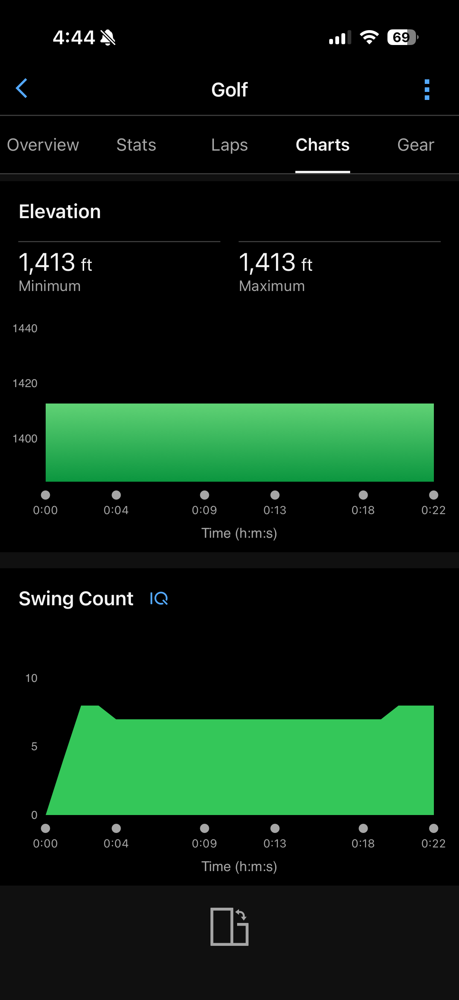
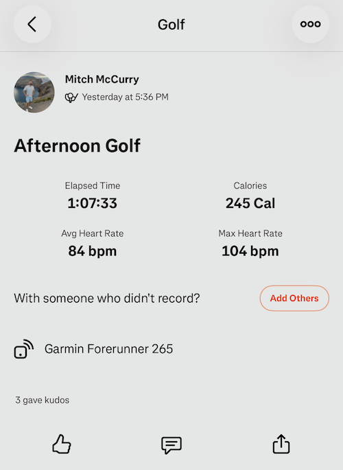

# Garmin Driving Range Lite



Garmin Driving Range Lite is a free, simple Garmin Connect IQ watch app for
basic driving range practice. It records a golf FIT activity, counts swings, and
shows a short recap after the activity is saved.

This repository is intended to be public so other Connect IQ developers can see
the project structure, app lifecycle, FIT recording, custom FIT fields, and
simple sensor-based swing counting.

## Features

- Starts a golf FIT activity when the app opens.
- Tracks elapsed time, heart rate, swing count, and Garmin activity calories.
- Detects swings from high-frequency accelerometer samples using the fastest
  rate supported by the device, capped at 100 Hz, with a short warmup period
  after start/resume to avoid startup sensor noise.
- Lets the user adjust swings manually with `Up` and `Down`.
- Uses `Start`/`Enter`/`Menu` to pause, resume, save, or discard.
- Adds a cumulative swing-count chart and final swing total to the synced
  activity in Garmin Connect.
- Shows a five-page saved-activity recap for swings, calories, heart rate,
  training effect, and duration.

## Controls

- `Start`, `Enter`, or `Menu`: open the pause menu.
- `Up`: add one swing.
- `Down`: subtract one swing, stopping at zero.
- Summary screen `Up`/`Down`: move through recap pages.
- Summary screen select/back/menu: exit the app.

Screen taps, holds, releases, swipes, and the back button are consumed during
the activity so the session is not accidentally interrupted.

## Preview

<p align="center">
  
  &nbsp;&nbsp;
  
</p>

<p align="center">
  
</p>

### Garmin Connect

Saved activities include the final swing count in the Connect IQ stats section
and a chart showing how the count changed during the session.

<p align="center">
  
  &nbsp;&nbsp;
  
</p>

Activities can also sync from Garmin Connect to connected services such as
Strava.

<p align="center">
  
</p>

## Project Layout

- `manifest.xml`: Connect IQ app metadata, supported devices, and permissions.
- `monkey.jungle`: Garmin project file.
- `img/`: screenshots and artwork used by this README and the store listing.
- `resources/fitfields.xml`: Garmin Connect chart and activity-summary metadata.
- `resources/`: app strings, drawables, and launcher icon.
- `source/RangeApp.mc`: app entry point and lifecycle bridge.
- `source/RangeView.mc`: activity recording, high-frequency accelerometer swing
  detection, FIT fields, and main UI.
- `source/RangeDelegate.mc`: in-activity input handling.
- `source/RangeMenuDelegate.mc`: pause menu actions.
- `source/RangeSummaryView.mc`: saved-activity recap pages.
- `build.sh`: local helper for building a device `.prg`.

## Requirements

- Garmin Connect IQ SDK.
- Garmin Monkey C extension for Visual Studio Code, recommended for simulator,
  device builds, and store export.
- JDK 17 for the included `build.sh` workflow.
- A private Garmin developer key for signing local builds and store packages.

Do not commit your developer key. This repo ignores `developer_key`, `.der`,
`.key`, and `.pem` files by default.

## Local Build

This repo includes a macOS helper script pointed at the local SDK path currently
used during development:

```sh
~/Library/Application\ Support/Garmin/ConnectIQ/Sdks/connectiq-sdk-mac-9.2.0-2026-06-09-92a1605b2
```

Build for Forerunner 265:

```sh
./build.sh
```

Build for another device listed in `manifest.xml`:

```sh
./build.sh fr965
```

The script writes the `.prg` to `/private/tmp` by default:

```sh
/private/tmp/driving-range-fr265.prg
```

On this macOS/JDK setup, Garmin's `monkeyc` shell wrapper can abort while
initializing Java AWT. The build script runs `monkeybrains.jar` directly in
headless mode with JDK 17.

## Publishing To Garmin Connect IQ

For Garmin Connect IQ Store submission, export an `.iq` package rather than a
single-device `.prg`.

Recommended path:

1. Open the project in Visual Studio Code.
2. Run `Monkey C: Verify Installation` from the command palette.
3. Test the app in the simulator and on at least one real device.
4. Run `Monkey C: Export Project`.
5. Select the products/languages to include.
6. Upload the generated `.iq` file in the Garmin Connect IQ developer dashboard.

Command-line equivalent:

```sh
export JAVA_HOME="$(/usr/libexec/java_home -v 17)"
export PATH="$JAVA_HOME/bin:$PATH"

java \
  -Xms128m \
  -Djava.awt.headless=true \
  -Dfile.encoding=UTF-8 \
  -classpath "$HOME/Library/Application Support/Garmin/ConnectIQ/Sdks/connectiq-sdk-mac-9.2.0-2026-06-09-92a1605b2/bin/monkeybrains.jar" \
  com.garmin.monkeybrains.Monkeybrains \
  -e \
  -f monkey.jungle \
  -o /private/tmp/garmin-driving-range-lite.iq \
  -y /path/to/private/developer_key
```

Generated `.prg`, `.iq`, MIR, cache, and debug build artifacts are intentionally
ignored by Git.


## Swing Detection Debug Logging

The debug data-collection branch emits one CSV-style console line for every
high-frequency accelerometer sample:

```text
ACCEL,timestamp_ms,x_mg,y_mg,z_mg,counted
ACCEL,123456,84,-912,1742,0
ACCEL,123466,215,-1380,2875,1
```

The timestamp is the per-sample timestamp supplied by Garmin when available.
X, Y, and Z are raw accelerometer axes in milli-G. The final field is `1`
only when that sample caused the current automatic detector to increment the
swing count; otherwise it is `0`.

This logging is intended for data collection and detector tuning rather than a
production release. Capture a range session containing known swings and
ordinary wrist movements, then filter lines beginning with `ACCEL,` for
analysis.
